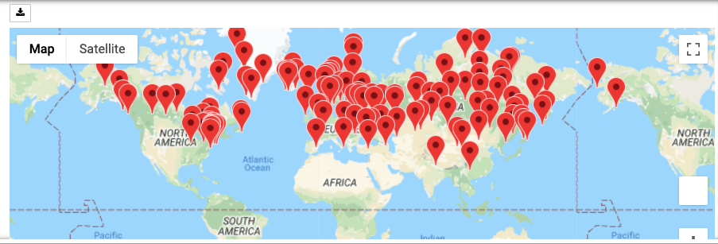
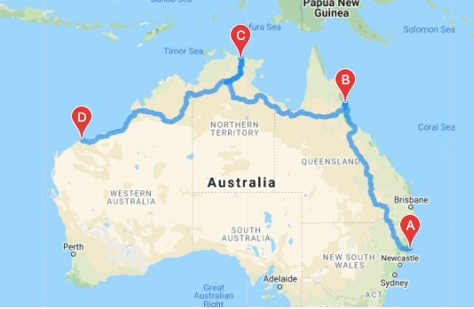
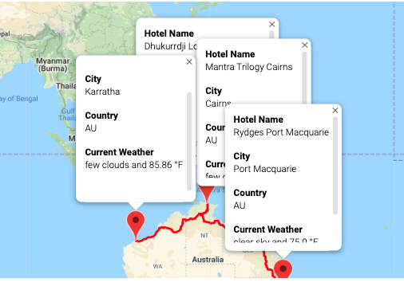

# World_Weather_Analysis

### Context
World Weather Analysis empowers travelers with real time data to inform their travel plans, shows them what weather to anticipate, and recommends hotels where they may want to stay.  The code requires three API sources to perform: CityPy, OpenWeatherAPI, and Google API's for maps and directions to destinations. 

### Analysis

In this analysis, three Python files were produced: 
* [The randomization of lat and long numbers and creation of a city map with weather information.](Weather_Database.ipynb)
* [The addition of input parameters that allow travelers to select preferred conditions of temperature and precipitation](Vacation_Search.ipynb)
* [Finally, a pre-determined travel itinerary that supports their exploration of four cities on one continent, in this case Australia to enjoy some shrimp on the barbie while croc-spotting.](Vacation_Itinerary.ipynb)

###### Two data files were created as outputs from the code: 
* [Weather Data for a global list of random cities.](data/WeatherPy_challenge.csv)
* [Vacation Data for cities that match input destination criteria.](data/WeatherPy_vacation.csv)

### Three images were captured to tell the data journey.

###### Initial map of cities that were randomly generated.

###### Initial map of travel destinations Down Under

###### Initial map of travel destinations Down Under

### Enjoy your visit Down Under!

